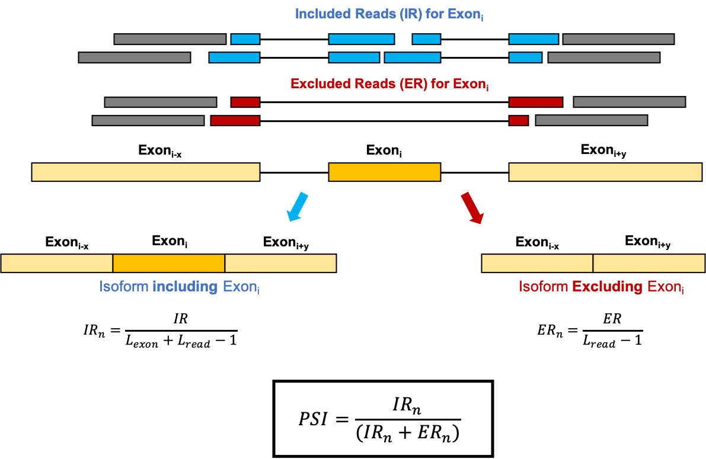
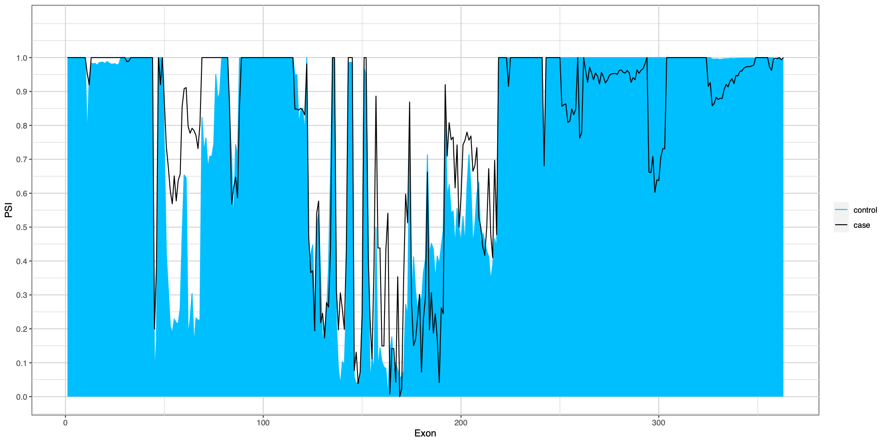

Calculate Percent Spliced-In (PSI)
==================================

This script compares the PSI between case and control samples for RNA-Seq data.

PSI is calculated on an individual basis and then averaged, NOT by comparing all cases merged vs. all controls merged.

If you just want to calculate PSI (no case/control comparison), label all samples as "case" or exclude the -c flag.

PSI Overview
------------

Required Programs
-----------------

This script uses the following programs; alternate versions may also work:

  * [bedtools/2.27.1](https://github.com/arq5x/bedtools2)
  * [gcc/6.2.0](https://linuxfromscratch.org/blfs/view/7.10/general/gcc.html)
  * [bowtie2/2.2.9](http://bowtie-bio.sourceforge.net/bowtie2/index.shtml)
  * [tophat/2.1.1](https://ccb.jhu.edu/software/tophat/index.shtml)
  * [R/3.6.1](https://www.r-project.org/)
  * [samtools/1.3.1](http://www.htslib.org/doc/1.3.1/samtools.html)

This program also uses some form of the following files:

  * The relevant genome file, e.g. [hg38](https://console.cloud.google.com/storage/browser/genomics-public-data/resources/broad/hg38/v0/)
  * A [GTF file](https://www.gencodegenes.org/human/release_27.html) associated with the relevant genome

The following Rscripts are included with this pipeline:

  * **configure-psi-byIndiv.R** *combine individual PSI output and calculate average PSI across samples* 
  * **comp-PSI.R** *compare cases to control (includes uncorrected p-values)*
  * **plot-psi.R** *generates a plot PSI plot for the transcript with the most exons, comparing cases and controls; the R package ggplot2 is required*
  * **plot-psi-noComp.R** *generates a plot for the transcript with the most exons, WITHOUT a comparison; the R package ggplot2 is required*

Flags
-----

| Flag | Argument                          | Default                                            | Description |
|------|-----------------------------------|----------------------------------------------------|-------------|
| -b   | filename (required)               | -                                                  | a file with col1=sample_id, col2=bam, and col2=case/control (example BAM list below) |
| -e   | \"G\"/\"T\" (required)            | -                                                  | \"G\" to calculate for a gene or \"T\" to calculate for a transcript
| -g   | gene/transcript ID (required)     | -                                                  | gene/transcript of interest |
| -c   | no argument  (optional)           | -                                                  | compare cases and controls (must be specified in bamlist) |
| -f   | GTF file (optional)               | ./hg38.gencode.v27.primary_assembly.annotation.gtf | the full path to the reference GTF file |
| -m   | temp directory (optional)         | ./                                                 | a temporary directory to store intermediate files |
| -n   | reference genome (optional)       | ./Homo_sapiens_assembly38.fasta                    | the full path to the reference genome |
| -o   | string (optional)                 | \<GENE\>_PSI                                       | the basename for output files |
| -p   | no argument (optional)            | -                                                  | generate a plot of the PSI for the transcript with the highest exon count (requires ggplot2 R package) |
| -r   | integer (optional)                | 50                                                 | the length of the read. Use the shortest sample read length, longer reads are trimmed |
| -h   | no argument (optional)            | -                                                  | print usage |

> -b (arg, required)     a file with col1=sample_id, col2=bam, and col2=case/control (example BAM list below) 
> -e (arg, required)     G/T - \"G\" to calculate for a gene or \"T\" to calculate for a transcript 
> -g (arg, required)     gene/transcript name 
> 
> -c                     compare cases and controls (must be specified in bamlist) 
> -f (arg)               the full path to the GTF file (default: ./hg38.gencode.v27.primary_assembly.annotation.gtf) 
> -m (arg)               a temporary directory to store intermediate files 
> -n (arg)               the full path to the reference genome (default: ./Homo_sapiens_assembly38.fasta) 
> -o (arg)               the basename for the output file (default: GENE_PSI) 
> -p                     generate a plot of the PSI for the transcript with the highest exon count (requires ggplot2 R package) 
> -r (arg)               the length of the read. Use the shortest sample read length, longer reads are trimmed (default: 50) 
> 
> -h                     print usage

Example Usage
-------------

For the TTN gene with NO comparison:  
    `get-psi-byIndi-github.sh -e G -g TTN -b bamlist.txt -o TTN_PSI`

For the MYH6-201 transcript comparing cases and controls and generating a plot:  
    `get-psi-byIndi-github.sh -e T -g MYH6-201 -b bamlist.txt -cp -o MYH6-201_PSI`

Example BAM List
----------------

> sample1	/path/to/case1/bam/sample1.bam	case 
> sample2	/path/to/case2/bam/sample2.bam	case 
> sample3	/path/to/control1/bam/sample3.bam	control 
> sample4	/path/to/control2/bam/sample4.bam	control 

Output
------

| File                   | Description                                                                                                                             |
|------------------------|-----------------------------------------------------------------------------------------------------------------------------------------|
| outname.fa             | a pseudo-genome extending 10kb on either side of the gene of interest  (can be loaded as genome into IGV)                          |
| outname.gff            | a GFF file for all exons used   (can be loaded into IGV with the outname.fa genome)                                                |
| outname.gtf            | a GTF file for all exons used   (can be loaded into IGV with the outname.fa genome)                                                |
| *.bam                  | reads aligned to outname.fa   (1 BAM/sample; can be loaded into IGV with the outname.fa genome)                                    |
| *junctions.bed         | a junctions file for each sample  (1 BED/sample; can be loaded into IGV with the outname.fa genome)                                |
| *-case.psi             | a PSI file for each case sample   (columns: exon ID, exon length, N included reads, N excluded reads, and PSI)                     |
| *-control.psi          | a PSI file for each control sample, requires -c flag  (columns: exon ID, exon length, N included reads, N excluded reads, and PSI) |
| gene.bed               | a bed file with the coordinates used to generate outname.fa                                                                             |
| case-tot.psi           | a file containing the PSI for all cases along with the average                                                                          |
| control-tot.psi        | a file containing the PSI for all controls along with the average, requires -c flag                                                     |
| psi-comparison.txt     | a file comparing cases and controls, requires -c flag  (columns: exon ID, average case PSI, average control PSI, exon, transcript, uncorrected t-test p-value) |
| *pdf                   | a plot of the PSI, requires -p flag (see below for example)                                                                             |
| outname-ref_coords.txt | the exon coordinates relative to the reference genome (as opposed to outname.fa)                                                        |

Example case/control plot (TTN-214):

`get-psi-byIndi-github.sh -e T -g TTN-214 -b bamlist.txt -c -o TTN-214-comp_PSI -p`

